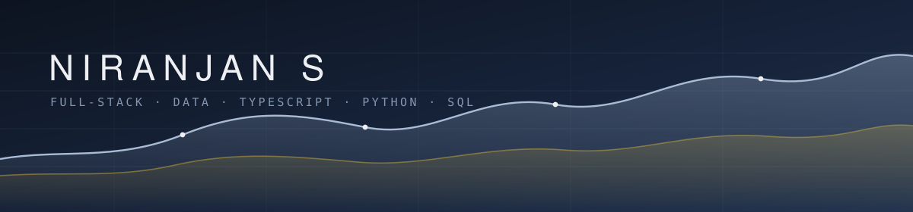

<div align="center">
  
</div>

<br/>

```console
niranjan@github:~$ cat about.md
```

I work at the join between web engineering and data analysis. On one side that
means storefronts taking real payments and dashboards people actually read; on
the other, SQL and pandas over inputs that arrive with duplicates and gaps
rather than arriving clean.

What I care about across both: a number should be traceable to where it came
from. A dashboard that cannot show you the query behind it is one you have to
take on faith, and the price a customer is shown should be the price they are
charged — computed once, in one place.

Everything below I built end to end and debugged until it worked.

<br/>

```console
niranjan@github:~$ ls -la projects/
```

<pre>
drwxr-xr-x   <a href="https://github.com/niranjan6030/grezzo"><b>grezzo/</b></a>
             Menswear denim commerce platform. Stock held per product, colour,
             size <i>and</i> warehouse on an append-only ledger; checkout takes a
             15-minute reservation instead of decrementing, so an abandoned
             payment never costs a sale. Pricing evaluates once on the server,
             so displayed and charged price cannot diverge.
             <b>next.js  typescript  postgres  firebase  razorpay  pytorch</b>
             → <a href="https://grezzo-ruddy.vercel.app">live</a> · <a href="https://github.com/niranjan6030/grezzo/blob/main/supabase/schema.sql">schema.sql</a> · <a href="https://github.com/niranjan6030/grezzo/blob/main/DEPLOY.md">deploy.md</a>

drwxr-xr-x   <a href="https://github.com/niranjan6030/Carbon-Ledger"><b>carbon-ledger/</b></a>
             270 years of global CO₂ emissions. Four questions, one of them the
             point: which countries grew an economy while cutting emissions.
             Ranking per capita rather than per country changes the answer,
             which is why both are shown.
             <b>python  pandas  javascript</b>
             → <a href="https://niranjan6030.github.io/Carbon-Ledger/carbon-ledger/app/index.html">live dashboard</a> · <a href="https://github.com/niranjan6030/Carbon-Ledger/tree/main/carbon-ledger/analysis">analysis/</a>

drwxr-xr-x   <a href="https://github.com/niranjan6030/ecommerce-dashboard"><b>ecommerce-dashboard/</b></a>
             Revenue against customer acquisition on one timeline — revenue up
             while acquisition flattens means the existing base is spending
             more; the reverse means growth is being bought. Plotting them
             apart hides that. Query inspector shows the request behind every
             figure on screen.
             <b>next.js  typescript  recharts</b>
             → <a href="https://ecommerce-dashboard-zeta-livid.vercel.app">live</a> · <a href="https://github.com/niranjan6030/ecommerce-dashboard/blob/main/app/api/analytics/route.ts">analytics/route.ts</a>

drwxr-xr-x   <a href="https://github.com/niranjan6030/hardware_inventory_supply_chain"><b>hardware-inventory/</b></a>
             GPU and hardware supply chain modelled relationally. Multi-table
             joins and CTEs surface stock shortages against supplier lead
             times; a Python job exports reorder alerts before anything
             actually runs out.
             <b>sql  python  pandas</b>
             → <a href="https://github.com/niranjan6030/hardware_inventory_supply_chain/blob/main/hardware_inventory_supply_chain/sql_queries/inventory_analysis.sql">inventory_analysis.sql</a> · <a href="https://github.com/niranjan6030/hardware_inventory_supply_chain/blob/main/hardware_inventory_supply_chain/python/inventory_report.py">inventory_report.py</a>

drwxr-xr-x   <a href="https://github.com/niranjan6030/VisionMetric-Dashboard"><b>vision-metric/</b></a>
             Real-time video processing with the engine kept separate from the
             interface. FPS and per-frame inference latency are both recorded,
             so an optimisation can be <i>shown</i> to be faster rather than
             assumed to be.
             <b>opencv  streamlit  python  numpy</b>
             → <a href="https://github.com/niranjan6030/VisionMetric-Dashboard/blob/main/vision-metric-dashboard/detector.py">detector.py</a> · <a href="https://github.com/niranjan6030/VisionMetric-Dashboard/blob/main/vision-metric-dashboard/benchmark.py">benchmark.py</a>

drwxr-xr-x   <a href="https://github.com/niranjan6030/food-delivery-analysis"><b>food-delivery-analysis/</b></a>
             Delivery times and revenue from raw order logs, duplicates and
             missing values left in on purpose. Missing times are imputed from
             city medians rather than a global one, because a slow city is slow
             for reasons that do not generalise.
             <b>python  pandas  matplotlib</b>
             → <a href="https://github.com/niranjan6030/food-delivery-analysis/blob/main/food_delivery_analysis/analysis.py">analysis.py</a> · <a href="https://github.com/niranjan6030/food-delivery-analysis/blob/main/food_delivery_analysis/generate_data.py">generate_data.py</a>
</pre>

<br/>

```console
niranjan@github:~$ cat stack.txt
```

<pre>
languages    typescript · python · sql · javascript
web          next.js · react · node · tailwind
data         pandas · numpy · postgres · mysql · matplotlib
ml / cv      pytorch · opencv · clip
platform     firebase · supabase · vercel · git
</pre>

<br/>

```console
niranjan@github:~$ contact --email
```

<pre>
niranjan6030@gmail.com          Bangalore, India
</pre>
